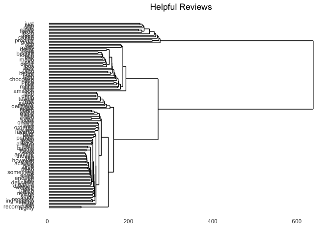
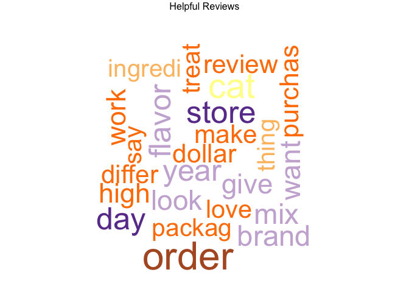
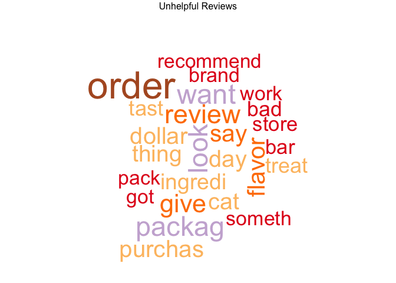
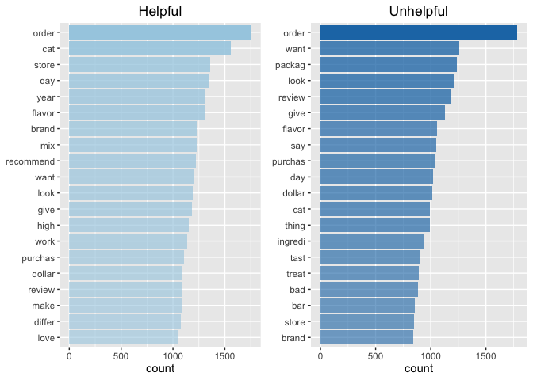
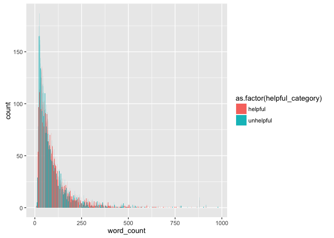
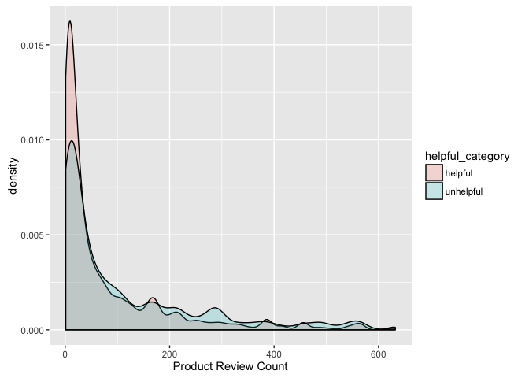

For getting row sums, I am using the `slam` package as it is a much more memory efficient way to do this.

``` r
# Create matrix
# helpful_matrix   <- as.matrix(helpful.dtm)
# unhelpful_matrix <- as.matrix(unhelpful.dtm)

# Calculate frequency
helpful_frequency   <- slam::row_sums(helpful.dtm, na.rm=T)
unhelpful_frequency <- slam::row_sums(unhelpful.dtm, na.rm=T)
```



In order to arrange the bar plots, I have used the `reorder()` function within the x aesthetics. Seems to be working.

``` r
helpful_df <- data.frame(word = names(helpful_frequency),
                         count = helpful_frequency) %>%
  arrange(desc(count)) %>%
  top_n(20)
```

    ## Selecting by count

``` r
unhelpful_df <- data.frame(word = names(unhelpful_frequency),
                           count = unhelpful_frequency) %>%
  arrange(desc(count)) %>%
  top_n(20)
```

    ## Selecting by count

``` r
helpful_word_plot <- ggplot(helpful_df,
                            aes(x = reorder(word, count), y = count)) +
  geom_bar(aes(alpha = count),
           stat="identity",
           fill = color_palette[[1]]) +
  coord_flip() +
  labs(x = NULL, y = "count", title = "Helpful") +
  scale_alpha_continuous(range = c(0.6, 1), guide = FALSE)

unhelpful_word_plot <- ggplot(unhelpful_df,
                              aes(x = reorder(word, count), y = count)) +
  geom_bar(aes(alpha = count),
           stat="identity",
           fill = color_palette[[2]]) +
  coord_flip() +
  labs(x = NULL, y = "count", title = "Unhelpful") +
  scale_alpha_continuous(range = c(0.6, 1), guide = FALSE)

grid.arrange(helpful_word_plot, unhelpful_word_plot, ncol = 2)
```



``` r
ggplot(reviews %>% filter(word_count < 1000),
       aes(word_count, fill = as.factor(helpful_category))) +
  geom_bar(position = "dodge")
```





``` r
ggplot(reviews,
    aes(x = helpful_category,
        y = afinn_sentiment_mean,
        fill = helpful_category)) +
    geom_boxplot() +
    labs(x = "Helpfulness",
         y = "Afinn Sentiment Mean",
         title = "Distribution of Helpfulness Afinn Sentiment") +
    scale_fill_manual(values = color_palette)
```


``` r
ggplot(reviews,
    aes(x = helpful_category,
        y = bing_sentiment_mean,
        fill = helpful_category)) +
    geom_boxplot() +
    labs(x = "Helpfulness",
         y = "Bing Sentiment Mean",
         title = "Distribution of Helpfulness Bing Sentiment") +
    scale_fill_manual(values = color_palette)
```


``` r
ggplot(reviews,
    aes(x = helpful_category,
        y = sentiment_mean,
        fill = helpful_category)) +
    geom_boxplot() +
    labs(x = "Helpfulness",
         y = "Syuzhet Sentiment Mean",
         title = "Distribution of Helpfulness Syuzhet Sentiment") +
    scale_fill_manual(values = color_palette)
```


